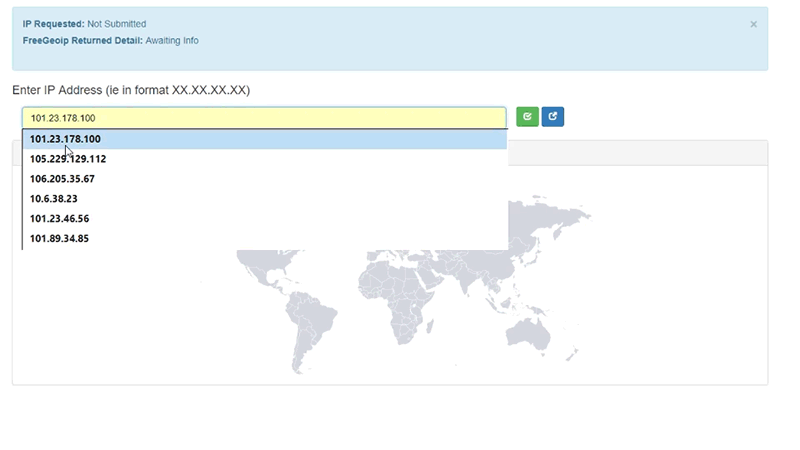

**Creating a PHP PDO IP Address Geolocation Map**

**Check out Bayesean Blog for more detailed information.**

<https://bayeseanblog.com/blog/create-a-visual-ip-address-geolocation-with-php/7>

Uses
----

-   PHP server side language use PHP 5.6 and higher`.`

-   [JVector Maps](http://jvectormap.com/). – Javascript based library .

    -   jVectorMap uses only native browser technologies like JavaScript, CSS,
        HTML, SVG or VML. No Flash or any other proprietary browser plug-in is
        required. This allows jVectorMap to work in all modern mobile browsers.

-   Updated to [Bootstrap 4](http://getbootstrap.com/) (framework).

-   Geolocation Library – https://ipstack.com.

    -   Head over to https://ipstack.com and follow the instructions to create
        your account and obtain your access token.

    -   If you only need basic IP to Geolocation data and do not require more
        than 10,000 requests per month, you can use the free account. If you'd
        like more advanced features or more requests than included in the free
        account you will need to choose one of the paid options.

    -   You can find an overview of all available plans at
        https://ipstack.com/productJSON – (JavaScript Object Notation) is a
        lightweight data-interchange format. Designed to easily read and write.
        Quick to parse and generate.

    -   While the old freegeoip API was limited to provide only the most basic
        IP to location data, our new API provides more than 20 additional data
        points including Language, Time Zone, Current Time, Currencies,
        Connection & ASN Information, and much more. To learn more about all the
        data points available

    -   10000 free calls per month.

Code
----

Download the code from above.

**Licence MIT.**

Happy Coding
