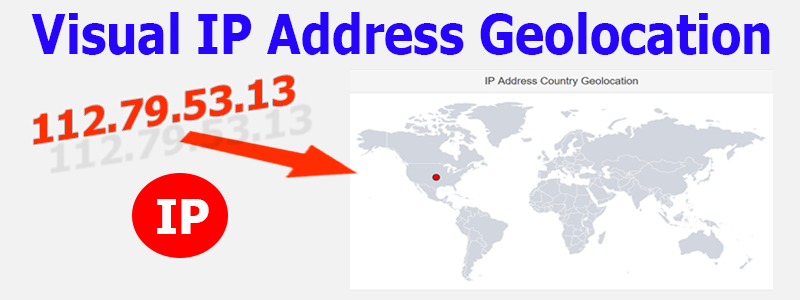
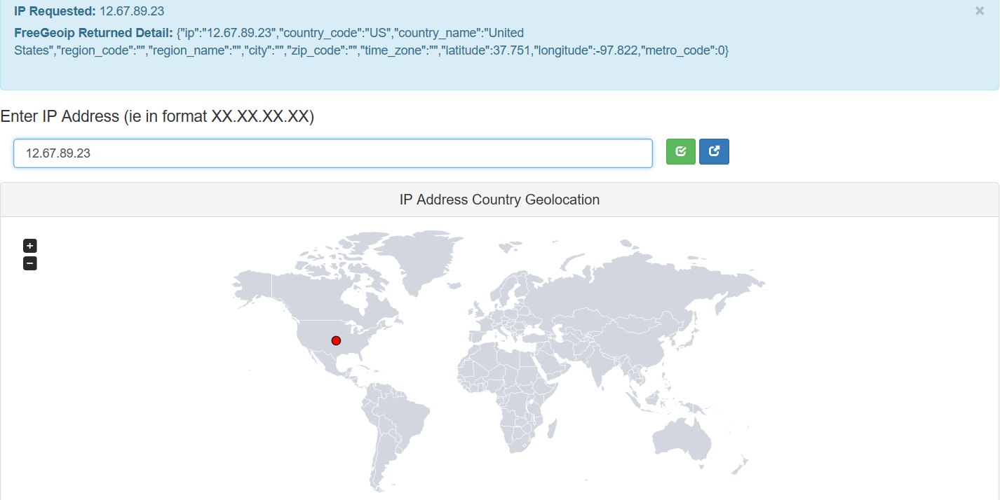
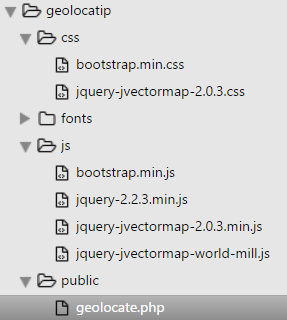

Create a Visual IP Address Geolocation
--------------------------------------

Project Scope
-------------

The purpose of the project is to be able to enter an IPaddress on the form and
immediately view the position and place of the IPAddress on the World Map. Be
able to re-enter any IPaddress.

View
----

Live-view the project here.

Languages and Libraries.
------------------------

-   PHP server side language use PHP 5.6 and higher`.`

-   [JVector Maps](http://jvectormap.com/). – Javascript based library .

    -   jVectorMap uses only native browser technologies like JavaScript, CSS,
        HTML, SVG or VML. No Flash or any other proprietary browser plug-in is
        required. This allows jVectorMap to work in all modern mobile browsers.

-   [Bootstrap 3](http://getbootstrap.com/) (framework).

-   Geolocation Library – [Freegeoip.net](http://freegeoip.net/) .

    -   Provides a public HTTP API for software developers to search the
        geolocation of IP addresses. It uses a database of IP addresses that are
        associated to cities along with other relevant information like time
        zone, latitude and longitude.

-   JSON – (JavaScript Object Notation) is a lightweight data-interchange
    format. Designed to easily read and write. Quick to parse and generate.

Why FreeGeoip
-------------

There are many geolocation IP libraries available Free/ Paid.

After reviewing a few libraries, I decided upon FreeGeoip.net. So why did I
choose FreeGeoip.net:-

-   It is a Free to use library.

-   Make up to 15000 IP requests per hour. Exceeding this will result in a
    temporary HTTP 403 result until the next hour.

-   API - Calls the website directly.

-   Can call JSON . (All the others tended to use XML in the API call) .

-   No registrations which means no API Key used. (Can be a risk).

FreeGeoip.net also has a Open Source Repository ’IP geolocation web server’
found at [GitHub](https://github.com/fiorix/freegeoip).

Geolocation information Level
-----------------------------

Calling the FreeGeoip.net Server…

This results in a JSON result as per below.

{"ip":"12.67.89.23","country\_code":"US","country\_name":"United
States","region\_code":"","region\_name":"","city":"","zip\_code":"","time\_zone":"","latitude":37.751,"longitude":-97.822,"metro\_code":0}

Project Code
------------

Structure:-

Download bootstrap 3 and JVectormap and place the files in the structure as
above.

Create geolocate.php

Geolocateip.php

This is the single file that the coed is created in. The full code can be viewed
and downloaded below.

Herewith is the server side code that receives the IP Address in a ‘Post
Request’ then calls the Freegeoip.net rest-server and receives the JSON
response.

The JSON is decoded to an Array and this then adjusted to fit the Jvector Map
marker format. This JSON styled object is sent to the Browser.

\<code\>

\<?php

\$ip = 'Not Submitted';

\$response = '';

\$info = 'Awaiting Info';

//Send empty data to activate an empty map (client)

\$phpstr = '[]';

if (!empty(\$\_POST)){

\$ip = trim(\$\_POST['ip']);

if (!filter\_var(\$ip, FILTER\_VALIDATE\_IP)){

\$ip = " Is not a valid ip address";

}

else{

//Collect info in JSON Format from FreeGeoip - set ip address to get info

//Set the path

\$ipaddress ="http://freegeoip.net/json/".trim(\$\_POST['ip']);

//Reads the file at the path returns a string (no options used)

\$ipaddress = file\_get\_contents(\$ipaddress);

// Alert ip info

\$info = \$ipaddress;

// decode the JSON string received into an associative array in a PHP variable

\$response = json\_decode(\$ipaddress,true);

// Manipulate the array into a map marker JSON Object format

\$new = "[{'latLng' : [" .\$response['latitude']. ", ".\$response['longitude'].
"] , 'name': '".\$response["country\_name"]."'}]";

//Send to Javascript (client) as a JSON type Object which in PHP means an Array
(No direct translation between PHP objects and JSON objects)

\$phpstr = \$new;

}

}

?\>

\<?code\>

For the second part of the Code , The JvectorMap - Javascript receives the PHP
variable into a Javascript variable object which is then directly used by
JvectorMap.

\<code\>

script language="JavaScript" type="text/javascript"\>

\$(function() {

//receive Server Response

var jsstr = \<?php echo \$phpstr; ?\>;

\$('\#world-map').vectorMap({

map: 'world\_mill',

normalizeFunction: 'polynomial',

hoverOpacity: 0.7,

hoverColor: false,

backgroundColor: 'transparent',

regionStyle: {

initial: {

fill: 'rgba(210, 214, 222, 1)',

"fill-opacity": 1,

stroke: 'none',

"stroke-width": 0,

"stroke-opacity": 1

},

hover: {

"fill-opacity": 0.7,

cursor: 'pointer'

},

selected: {

fill: 'yellow'

},

selectedHover: {}

},

markerStyle: {

initial: {

fill: 'red',

stroke: '\#111',

size: '2'

}

},

markers: jsstr

});

});

\</script\>

\</code\>
